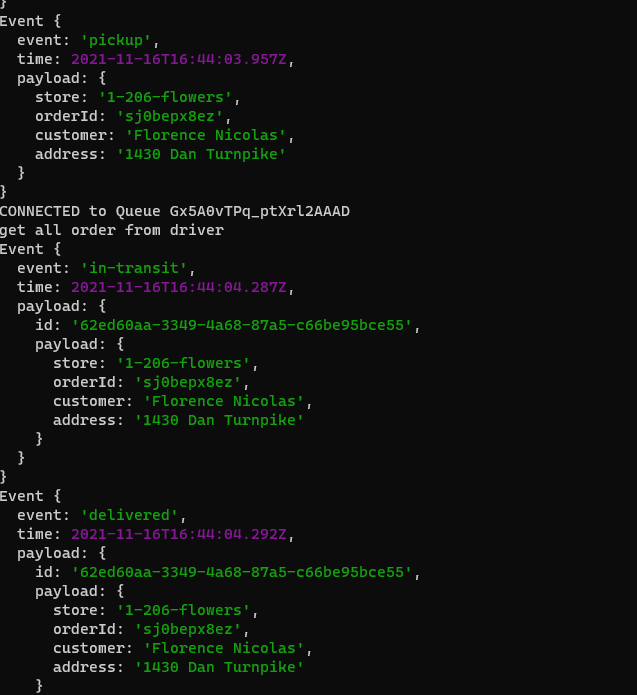
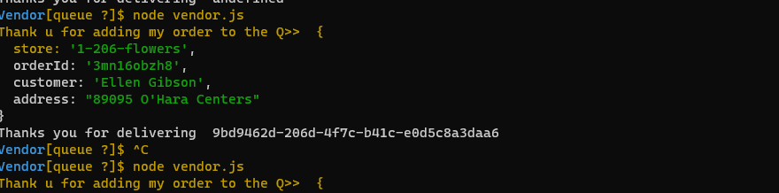
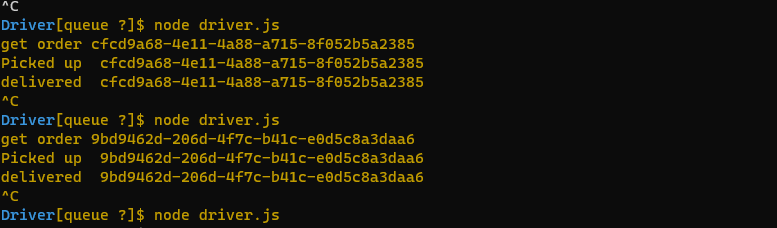
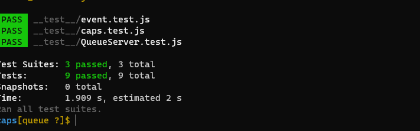
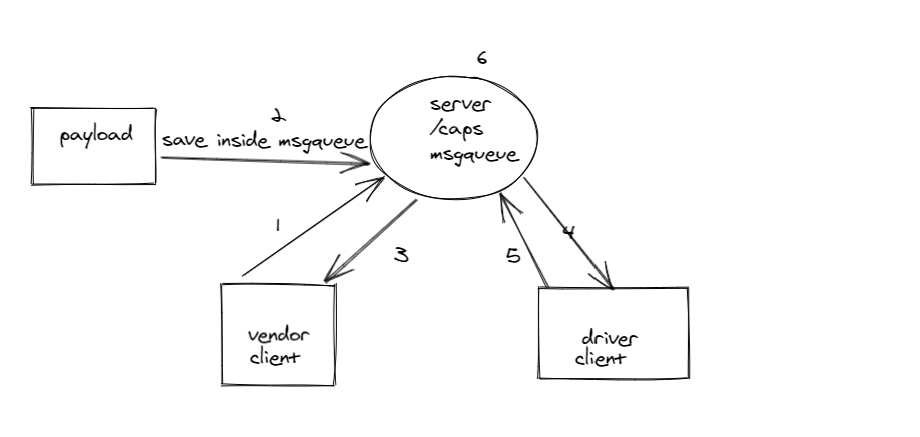

# caps

# Lab13

[PR](https://github.com/AseelAlasaad/caps/pull/6)

[Action](https://github.com/AseelAlasaad/caps/actions)

# Result

run app node server.js

 

run app node Vendor.js

run app node Driver.js

# Test

test, npm run test

# UML

# caps

# Lab12

[PR](https://github.com/AseelAlasaad/caps/pull/5)

[Action](https://github.com/AseelAlasaad/caps/actions)

# Result

run app node caps.js

run app node Vendor.js

run app node Driver.js

# Test

test, npm run test

# UML

# Lab11

[PR](https://github.com/AseelAlasaad/caps/pull/1)

[Action](https://github.com/AseelAlasaad/caps/actions)

# Result

run app node callevent.js

# Test

test, npm run test

# UML

